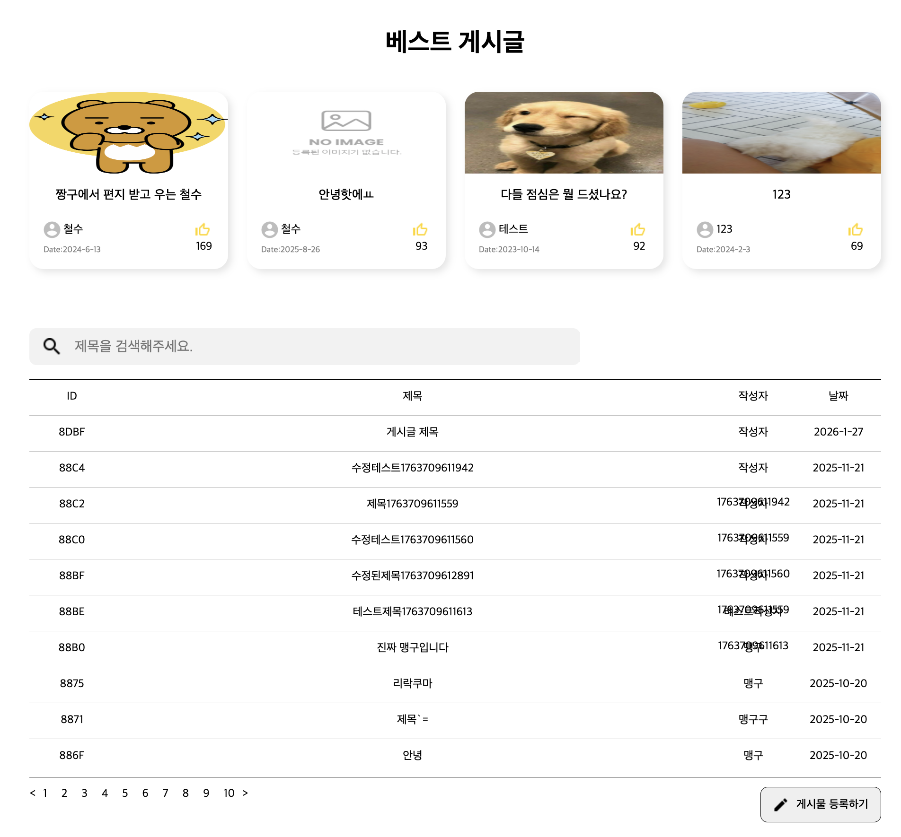
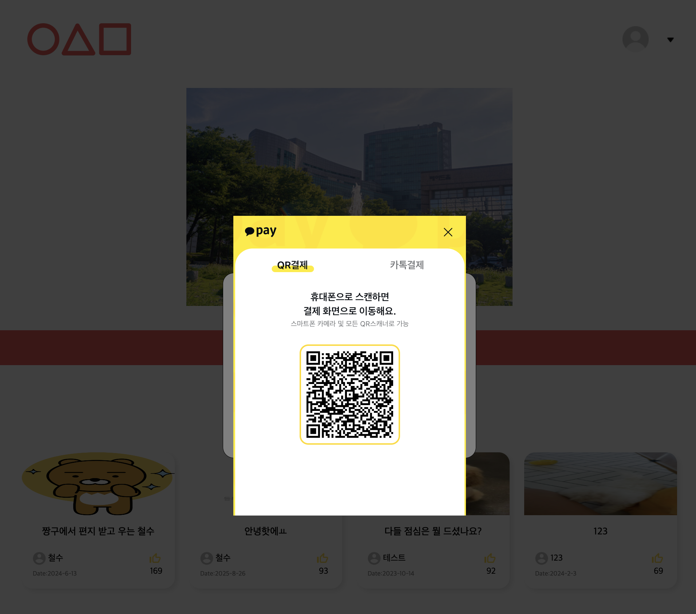

# 🛒 중고마켓 프론트엔드 웹 서비스

React 기반으로 구현된 **중고마켓 기능의 프론트엔드 웹 서비스**입니다.  
기존에 제공된 서버(API)를 연동하여 상품 조회, 목록 표시 등 중고마켓의 핵심 UI 흐름을 구현하는 데 초점을 둔 FE를 학습하기 위한 프로젝트입니다.

> 현재는 AWS 서버 연결을 해제한 상태이며,  
> 본 레포지토리는 **프론트엔드 구현 및 로컬 실행 환경**을 중심으로 관리됩니다.

---

## 🧩 주요 기능

- 게시판 기능
- 중고 상품 목록 조회
- 상품 상세 페이지 UI 구성
- 카카오페이 결제 (테스트기능)

---

## 🛠 Tech Stack

### Frontend

- **React**
- Typescript
- Yarn

### Development Environment

- Node.js
- Local Development Server (`yarn dev`)

---

## 📸 Screenshots

<p align="center">
  
  
  
</p>

## 🚀 실행 방법 (Local)

아래 절차를 통해 로컬 환경에서 프로젝트를 실행할 수 있습니다.

```bash
# 1. 레포지토리 클론
git clone <repository-url>

# 2. 프로젝트 디렉토리 이동
cd <project-directory>

# 3. 의존성 설치
yarn install

# 4. 개발 서버 실행
yarn dev
```
